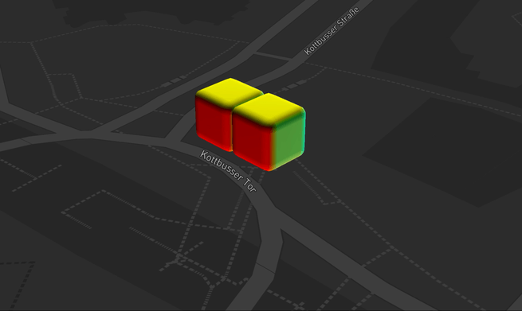

# mapbox-gl-camera

Camera helper for WebGL custom layers on top of [mapbox-gl-js](https://github.com/mapbox/mapbox-gl-js).

**WIP**, check Issues

## Installation

```
npm install mapbox-gl-camera
```

## Usage

```
import { Camera } from 'mapbox-gl-camera';

const camera = new Camera();

// ...

mapInstance.on('style.load', () => {
  mapInstance.addLayer({
    id: 'custom_layer',
    type: 'custom',
    onAdd: function (map, gl) {
      // ...
    },
    render: function (gl, matrix) {
      camera.update(mapInstance, matrix);

      camera.view;            // <-- view matrix
      camera.projection;      // <-- projection matrix
      camera.viewProjection;  // <-- projection*view matrix
      camera.world;           // <-- world matrix

      camera.positionFromLngLatAlt([13.418314, 52.49871, 10]) // calculates world position from LngLatAlt coordinates

      mapInstance.triggerRepaint();
    }
  });
});

```


## Example

### Using [regl](https://github.com/regl-project/regl)

source: [examples/regl.js](examples/regl.js)

## References
 * https://github.com/mapbox/mapbox-gl-js/issues/7395
 * https://github.com/mapbox/mapbox-gl-js/issues/7268
